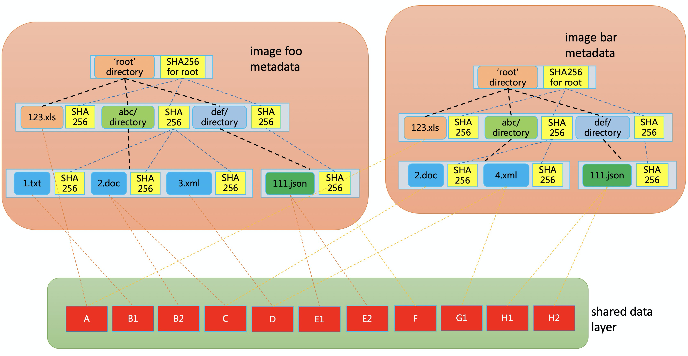

# Introducing Dragonfly Container Image Service
## Small is Fast, Large is Slow

With containers, it is relatively fast to deploy web apps, mobile backends, and API services right out of the box. Why? Because the container images they use are generally small (hundreds of MBs).

A larger challenge is deploying applications with a huge container image (several GBs). It takes a good amount of time to have these images ready to use. We want the time spent shortened to a certain extent to leverage the powerful container abstractions to run and scale the applications fast.

Dragonfly has been doing well at distributing container images. However, users still have to download an entire container image before creating a new container. 
Another big challenge is arising security concerns about container image.

Conceptually, we pack application's environment into a single image that is more easily shared with consumers.  Image is then put into a filesystem locally on top of which an application can run. The pieces that are now being launched as nydus are the culmination of the years of work and experience of our team in building filesystems.
Here we introduce the [dragonfly image service (codename nydus)](https://github.com/dragonflyoss/image-service) as an extension to the Dragonfly project.  It's software that minimizes download time and provides image integrity check across the whole lifetime of a container, enabling users to manage applications fast and safely.

nydus is co-developed by engineers from Alibaba Cloud and Ant Group. It is widely used in the internal production deployments. From our experience, we value its container creation speedup and image isolation enhancement the most. And we are seeing interesting use cases of it from time to time.

## Nydus: Dragonfly Image Service

The nydus project designs and implements an user space filesystem on top of a container image format that improves over the current OCI image specification. Its key features include:
* Container images are downloaded on demand
* Chunk level data duplication
* Flatten image metadata and data to remove all intermediate layers
* Only usable image data is saved when building a container image
* Only usable image data is downloaded when running a container
* End-to-end image data integrity
* Compactible with the OCI artifacts spec and distribution spec
* Integrated with existing CNCF project dragonfly to support image distribution in large clusters
* Different container image storage backends are supported

Nydus mainly consists of a new containier image format and a FUSE (Filesystem in USErspace) daemon to translate it into container accessible mountpoint.

The FUSE daemon takes in either [FUSE](https://www.kernel.org/doc/html/latest/filesystems/fuse.html) or [virtiofs](https://virtio-fs.gitlab.io/) protocol to service POD created by conventional runc  containers or [Kata Containers](https://katacontainers.io/). It supports pulling container image data from container image registry, [OSS](https://www.alibabacloud.com/product/oss), NAS, as well as Dragonfly supernode and node peers. It can also optionally use a local directory to cache all container image data to speed up future container creation.

Internally, nydus splits a container image into two parts: a metadata layer and a data layer. The metadata layer is a self-verifiable [merkle tree](https://en.wikipedia.org/wiki/Merkle_tree). Each file and directory is a node in the merkle tree with a hash aloneside. A file's hash is the hash of its file content, and a directory's hash is the hash of all of its descendents. Each file is divided into even sized chunks and saved in a data layer. File chunks can be shared among different container images by letting file nodes pointing inside them point to the same chunk location in the shared data layer.

## How can you benefit from nydus?

The immediate benefit of running nydus image service is that users can launch containers almost instantly. In our tests, we found out that nydus can boost container creation from minutes to seconds.

Another less-obvious but important benefit is runtime data integration check. With OCIv1 container images, the image data cannot be verified after being unpacked to local directory, which means if some files in the local directories are undermined either intentionally or not, containers will simply take them as is, incurring data leaking risk.  In contrast, nydus image won't be unpacked to local directory at all, what's more, given that verification can be enforced on every data access to nydus image, the data leak risk can be completely avoided by forcing to fetch the data from the trusted image registry again.

## The Future of Nydus

The above examples showcase the power of nydus. For the last year, we've worked alongside the production team, laser-focused on making nydus stable, secure, easy to use.

Now, as the foundation for nydus has been laid, our new focus is the ecosystem it aims to serve broadly. We envision a future where users install dragonfly and nydus on their clusters, run containers with large image as fast they do with regular size image today, and feel confident about the safety of data on their container image.

## For the community

While we have widely deployed nydus in our production, we believe a proper upgrade to OCI image spec shouldn’t be built without the community. To this end, we propose nydus as a reference implementation that aligns well with the OCI image spec v2 proposal [1], and we look forward to working with other industry leaders should this project come to fruition.

## FAQ
#### Q: What are the challenges with oci image spec v1?
* ["The Road to OCIv2 Images: What's Wrong with Tar?"](https://www.cyphar.com/blog/post/20190121-ociv2-images-i-tar) written by Aleksa Sarai covers all the challenges with OCIv1, a quick summary of his article is that tar is legacy and doesn't fit well to be a container image format.

#### Q: How is this different than crfs?
* The basic idea of the two are quite similar. Deep down, the nydus image format supports chunk level data deduplication and end-to-end data integraty at runtime, which is an improvement over the stargz format used by crfs.

#### Q: How is this different than Teleport of Azure?
* Azure Teleport is like the current OCI image format plus a SMB-enabled snapshotter. It supports container image lazy-fetching and suffers from all the Tar format defects. OTOH, nydus deprecates the legacy Tar format and takes advantage of the merkle tree format to provide more advantages over the Tar format.

#### Q: What if network is down while container is running with nydus?
* With OCIv1, container would fail to start at all should network be down while container image is not fully downloaded.  Nydus has changed that a lot because it goes with lazy fetch/load mechanism, a failure in network may take down a running container. Nydus addresses the problem with a prefetch mechanism which can be configured to run in background right after starting a container.

## [1]：OCI Image Specification V2 Requirements
In the mean time, the OCI (Open Container Initiate) community has been actively discussing the emerging of OCI image spec v2 aiming to address new challenges with oci image spec v1. 

Starting from June 2020, the OCI community spent more than a month discussing the requirements for OCI image specification v2. It is important to notice that OCIv2 is just a marketing term for updating the OCI specification to better address some use cases. It is not a brand new specification.

The discussion went from an email thread ([Proposal Draft for OCI Image Spec V2](https://groups.google.com/a/opencontainers.org/g/dev/c/Zk3yf45HIdA)) and [a shared document](https://hackmd.io/@cyphar/ociv2-brainstorm) to several OCI community online meetings, and the result is quite aspiring. The concluded OCIv2 requirements are:
* Reduced Duplication
* Canonical Representation (Reproducible Image Building)
* Explicit (and Minimal) Filesystem Objects and Metadata
* Mountable Filesystem Format
* Bill of Materials
* Lazy Fetch Support
* Extensibility
* Verifiability and/or Repairability
* Reduced Uploading
* Untrusted Storage

For detailed meaning of each requirement, please refer to [the original shared document](https://hackmd.io/@cyphar/ociv2-brainstorm). We actively joined the community discussions and found out that the nydus project fits nicely to these requirements. It further encouraged us to opensource the nydus project to help the community discussion with a working code base.
