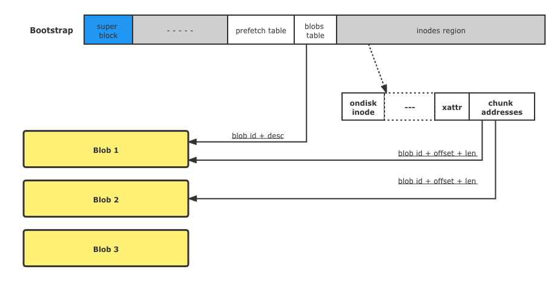
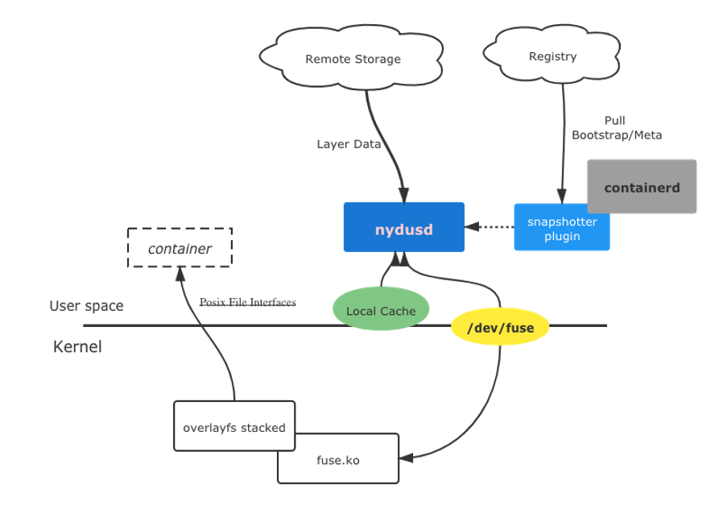
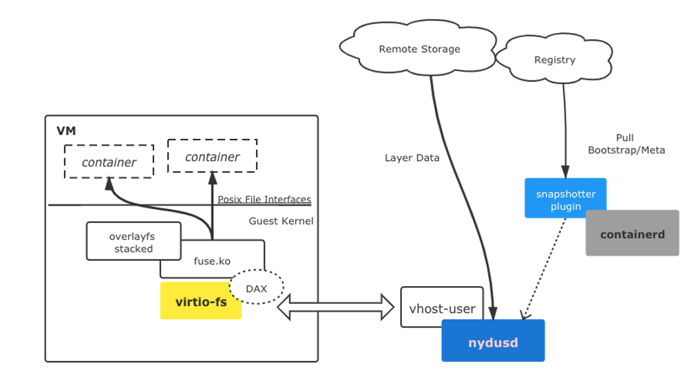
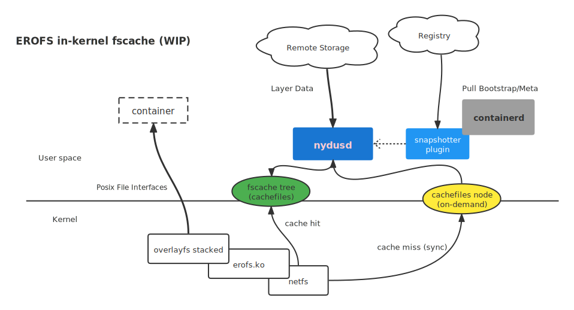

# Containerd Accepted Nydus-snapshotter

Early January, Containerd community has taken in nydus-snapshotter as a sub-project. Check out the code, particular introductions and tutorial from its [new repository](https://github.com/containerd/nydus-snapshotter). We believe that the donation to containerd will attract more users and developers for nydus itself and bring much value to the community users.

Nydus-snapshotter is a containerd's remote snapshotter, it works as a standalone process out of containerd, which only pulls nydus image's bootstrap from remote registry and forks another process called **nydusd**. Nydusd has a unified architecture, which means it works in form of a FUSE user-space filesystem daemon, a virtio-fs daemon or a fscache user-space daemon. Nydusd is responsible for fetching data blocks from remote storage like object storage or standard image registry, thus to fulfill containers' requests to read its rootfs.

Nydus is an excellent container image acceleration solution which significantly reduces time cost by starting container. It is originally developed by a virtual team from Alibaba Cloud and Ant Group and deployed in very large scale. Millions of containers are created based on nydus image each day in Alibaba Cloud and Ant Group. The underlying technique is a newly designed, container optimized and oriented read-only filesystem named **Rafs**. Several approaches are provided to create rafs format container image.
The image can be pushed and stored in standard registry since it is compatible with OCI image and distribution specifications. A nydus image can be converted from a OCI source image where metadata and files data are split into a "bootstrap" and one or more "blobs" together with necessary manifest.json and config.json. Development of integration with Buildkit is in progress.

​

Nydus provides following key features:

- Chunk level data de-duplication among layers in a single repository to reduce storage, transport and memory cost
- Deleted(whiteout) files in certain layer aren't packed into nydus image, therefore, image size may be reduced
- E2E image data integrity check. So security issues like "Supply Chain Attack" can be avoided and detected at runtime
- Integrated with CNCF incubating project Dragonfly to distribute container images in P2P fashion and mitigate the pressure on container registries
- Different container image storage backends are supported. For example, Registry, NAS, Aliyun/OSS and applying other remote storage backend like AWS S3 is also possible.
- Record files access pattern during runtime gathering access trace/log, by which user's abnormal behaviors are easily caught. So we can ensure the image can be trusted

Beyond above essential features, nydus can be flexibly configured as a FUSE-base user-space filesystem or in-kernel EROFS with an on-demand loader user-space daemon and integrating nydus with VM-based container runtime is much easier.

- Lightweight integration with VM-based containers runtime like KataContainers. In fact, KataContainers is considering supporting nydus as a **native** image acceleration solution.
- Nydus closely cooperates with Linux **in-kernel** disk filesystem Containers' rootfs can directly be set up by EROFS with lazy pulling capability. The corresponding changes had been merged into Linux kernel since v5.16

To run with runc, nydusd works as FUSE user-space daemon:

To work with KataContainers, it works as a virtio-fs daemon:

Nydus community is working together with Linux Kernel to develop erofs+fscache based user-space on-demand read.

Nydus and eStargz developers are working together on a new project named [acceld](https://github.com/goharbor/acceleration-service) in **Harbor** community to provide a general service to support the conversion from OCI v1 image to kinds of acceleration image formats for various accelerator providers, so that keep a smooth upgrade from OCI v1 image. In addition to the conversion service acceld and the conversion tool nydusify, nydus is also supporting buildkit to enable exporting nydus image directly from Dockerfile as a compression type.

In the future, nydus community will work closely with the containerd community on fast and efficient methods and solution of distributing container images, container image security, container image content storage efficiency, etc.
