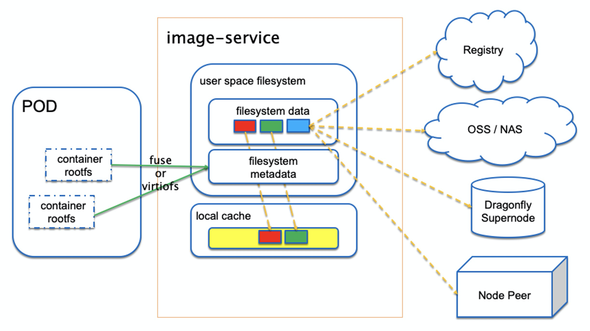
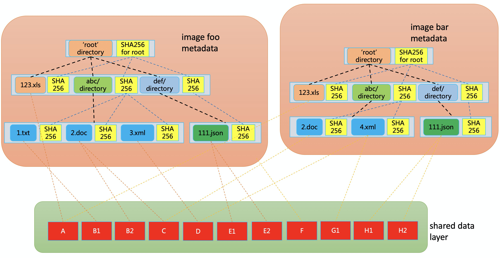
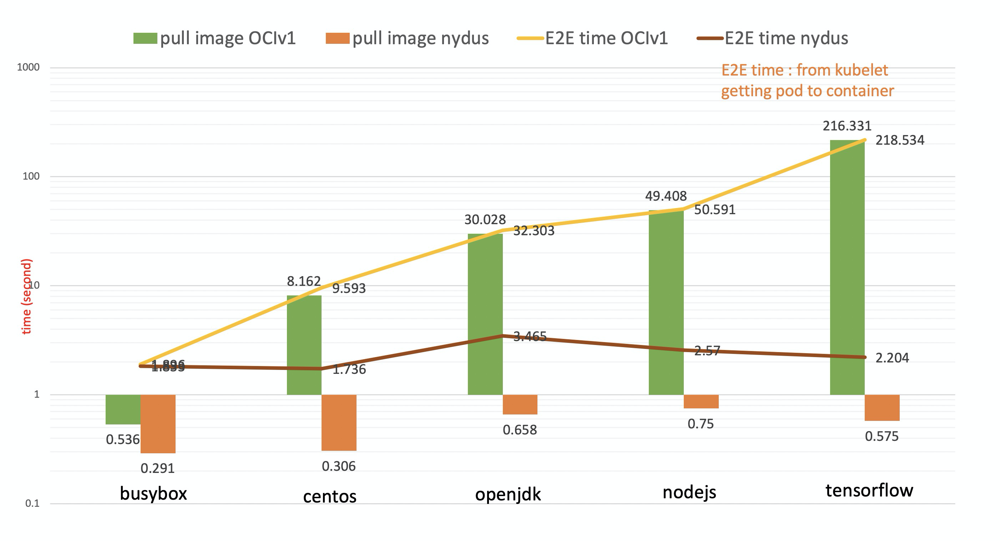
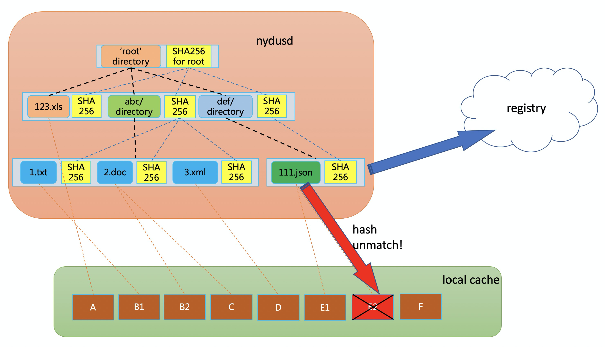

# Dragonfly 发布 Nydus 容器镜像加速服务
## 镜像对容器部署的挑战

在容器的生产实践中，偏小的容器镜像能够很快的部署启动。当应用的镜像达到几个GB以上的时候，在节点上下载镜像通常会消耗大量的时间。Dragonfly 通过引入 P2P 网络有效的提升了容器镜像大规模分发的效率。然而，用户还是必须等待镜像数据完整下载到本地，然后才能创建自己的容器。我们希望进一步缩减镜像下载的时间，让用户能够更快地部署容器应用。同时，如何更好的保护用户的数据，也是容器行业近年来的重要关注点。

为此，我们为Dragonfly项目引入了一个[容器镜像加速服务 nydus](https://github.com/dragonflyoss/image-service) 。nydus 能够极大缩短镜像下载时间，并提供端到端的镜像数据一致性校验，从而让用户能够更安全快捷地管理容器应用。nydus 由阿里云和蚂蚁集团的工程师合作开发，并大规模部署在内部的生产环境中。 作为云原生生态的一部分， nydus 在生产环境的优秀表现，让我们有信心现在将项目开源，让更多的容器用户能够体验到容器快速启动和安全加载方面的能力。

## Nydus: Dragonfly 的容器镜像服务
nydus 项目优化了现有的 OCI 镜像标准格式，并以此设计了一个用户态的文件系统。通过这些优化，nydus 能够提供这些特性：
* 容器镜像按需下载，用户不再需要下载完整镜像就能启动容器
* 块级别的镜像数据去重，最大限度为用户节省存储资源
* 镜像只有最终可用的数据，不需要保存和下载过期数据
* 端到端的数据一致性校验，为用户提供更好的数据保护
* 兼容 OCI 分发标准和 artifacts 标准，开箱即可用
* 支持不同的镜像存储后端，镜像数据不只可以存放在镜像仓库，还可以放到 NAS 或者类似 S3 的对象存储上
* 与 Dragonfly 的良好集成

架构上， nydus 主要包含一个新的镜像格式，和一个负责解析容器镜像的 FUSE 用户态文件系统进程。

nydus 能够解析 [FUSE](https://www.kernel.org/doc/html/latest/filesystems/fuse.html) 或者 [virtiofs](https://virtio-fs.gitlab.io/) 协议来支持传统的 [runc 容器](https://github.com/opencontainers/runc)或者 [Kata 容器](https://katacontainers.io/)。容器仓库，[OSS 对象存储](https://www.alibabacloud.com/product/oss)，NAS，以及 Dragonfly 的超级节点和 peer 节点都可以作为 nydus 的镜像数据源。同时， nydus 还可以配置一个本地缓存，从而避免每次启动都从远端数据源拉取数据。

镜像格式方面， nydus 把一个容器镜像分成元数据和数据两层。其中元数据层是一颗[自校验的哈希树](https://en.wikipedia.org/wiki/Merkle_tree)。每个文件和目录都是哈希树中的一个附带哈希值的节点。一个文件节点的哈希值是由文件的数据确定，一个目录节点的哈希值则是由该目录下所有文件和目录的哈希值确定。每个文件的数据被按照固定大小切片并保存到数据层中。数据切片可以在不同文件以及不同镜像中的不同文件共享。

## Nydus 能为用户带来什么？
用户如果部署了 nydus 镜像服务，最直观的一个感受就是，容器启动变快了，从以前的明显时间消耗，变成了几乎瞬间就能启动起来。在我们的测试中， nydus 能够把常见镜像的启动时间，从数分钟缩短到数秒钟。

另外一个不那么明显但也很重要的改进，是 nydus 能够为用户提供容器运行时数据一致性校验。在传统的镜像中，镜像数据会先被解压到本地文件系统，再由容器应用去访问使用。解压前，镜像数据是完整校验的。但是解压之后，镜像数据不再能够被校验。这带来的一个问题就是，如果解压后的镜像数据被无意或者恶意地修改，用户是无法感知的。而 nydus 镜像不会被解压到本地，同时可以对每一次数据访问进行校验，如果数据被篡改，则可以从远端数据源重新拉取。

## 未来规划

前面我们介绍了 nydus 的架构和优点。在过去的一年里，我们和内部的产品团队一起致力于让 nydus 项目更稳定，安全和易用。在把 nydus 项目开源之后，我们将会更关注广泛的云原生容器生态。我们的愿景是，当用户在集群中部署 Dragonfly 和 nydus 服务的时候，无论镜像大小，用户都能够方便快捷地运行他们的容器应用，同时不需要为容器镜像的数据安全性担忧。

## OCI 社区容器镜像标准
虽然我们已经在内部生产环境中大规模部署 nydus，我们坚信对 OCI 镜像标准的改进需要广泛的社区合作。为此，我们积极地参与了 OCI 社区关于下一代镜像标准的讨论，并发现 nydus 能够广泛地符合 OCI 社区对下一代镜像格式的要求。所以我们提议把 nydus 作为 OCI 社区下一代镜像格式的示例实现，并期待和更多的云原生行业领导者们一起推进下一代镜像标准的制定和实现。

## FAQ
#### Q: 现有的 OCI 镜像标准有什么问题？
* SUSE 的 Aleksa Sarai 写过一个 blog ([The Road to OCIv2 Images: What's Wrong with Tar?](https://www.cyphar.com/blog/post/20190121-ociv2-images-i-tar))，详细地描述了现有 OCI 镜像标准的一系列问题，简单总结就是 OCI 镜像标准使用的 tar 格式太古老并不适合作为容器镜像格式。

#### Q: nydus 和 CRFS 有什么区别？
* CRFS 是 GO build team 设计的一个镜像格式。二者在主要设计思想上非常相似。细节上， nydus 支持块级别的数据去重和端到端的数据一致性校验，可以说是在 CRFS 的 stargz 格式上的进一步改进。

#### Q: nydus 和 Azure 的 Teleport 有什么区别？
* Azure Teleport 更像是现有 OCI 镜像标准在基于 SMB 文件共享协议的 snapshotter 上的一个部署实现，能够支持容器镜像数据按需下载，但保留了所有目前 OCI 镜像 tar 格式的缺陷。相对的， nydus 抛弃了过时的 tar 格式，并使用 merkle tree 格式来提供更多的高级特性。

#### Q: 如果运行基于 nydus 的容器的时候网络断了怎么办？
* 使用现有 OCI 镜像的时候，如果在容器镜像还没有完整下载的时候网络断了，容器会一开始就无法启动。 nydus 很大程度上改变了容器启动的流程，用户不需要再等待镜像数据完整下载就能启动容器。而容器运行时如果网络断了，将无法访问没有下载到本地的镜像数据。 nydus 支持在容器启动后在后台下载容器镜像数据，所以当容器镜像数据完整下载到本地后，基于 nydus 的容器也不会受到网络中断的影响。

## 附录：OCIv2 镜像标准
从 2020 年 6 月开始，OCI 社区花了一个多月时间密集讨论了当前 OCI 镜像标准的缺陷，以及 OCIv2 镜像格式需要满足哪些要求。OCIv2 在这里只是一个宣传命名，实际上 OCIv2 是当前 OCI 镜像标准的改进，而不会是一个全新的镜像标准。

这次镜像格式大讨论从一个邮件和一份共享文档开始，并促成了多次在线的 OCI 社区讨论会议。最后的结论也很鼓舞人心，OCIv2 镜像格式需要满足下列要求：
* 更少的重复数据
* 可重建的镜像格式
* 明确的更少的文件系统元数据
* 可以 mount 的文件系统格式
* 镜像内容列表
* 镜像数据按需加载
* 可扩展性
* 可校验和/或可修复
* 更少的上传数据
* 可以工作在不可信存储上

在这份[共享文档](https://hackmd.io/@cyphar/ociv2-brainstorm)中可以找到每一个要求的详细描述。我们全程参与了整个 OCIv2 镜像格式要求的讨论，并发现 nydus 很好地满足了全部的这些要求。这进一步促使我们开源 nydus 项目来为社区讨论提供一个工作的代码基础。
