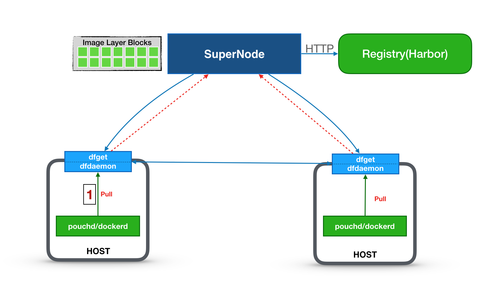

# Dragonfly Quick Start

Dragonfly Quick Start document aims to help you to quick start Dragonfly journey. This experiement is quite easy and simplified. If you are using Dragonfly in your production environment to handle production image distribution, please refer to supernode and dfget's detailed production parameter configuration.

## Prerequisites

Assuming that quick start experiement requires us to prepare three host machines, one to play a role of supernode, and the other two for dfclient. Then the topology of the three nodes cluster is like the following:



Then, we must provice:

1. three host nodes in a LAN
2. every node has deployed docker daemon

## Step 1: Deploy SuperNode (Dragonfly Server)

Above three nodes we prepared, we choose one for deploying supernode. 

1. Pull the docker image we provided.

```bash
docker pull dragonflyoss/supernode:0.3.0
```

2. Start a SuperNode.

```bash
docker run -d -p 8001:8001 -p 8002:8002 dragonflyoss/supernode:0.3.0 -Dsupernode.advertiseIp=127.0.0.1
```

> **NOTE**: `supernode.advertiseIp` should be the ip that clients can connect to, `127.0.0.1` here is an example for testing.

## Step 2. Configure Docker Daemon

After deploying Supernode in one node successfully, we should deploy dfclient(Dragonfly Client) on each of the rest two nodes. However, before deploying dfclient, we must configure Docker Daemon on both two nodes to add parameter `registry-mirrors`.

1. Modify the configuration file `/etc/docker/daemon.json`.

```sh
vi /etc/docker/daemon.json
```

**Tip:** For more information on `/etc/docker/daemon.json`, see [Docker documentation](https://docs.docker.com/registry/recipes/mirror/#configure-the-cache).

2. Add or update the configuration item `registry-mirrors` in the configuration file.

```sh
"registry-mirrors": ["http://127.0.0.1:65001"]
```

3. Restart Docker Daemon。

```bash
systemctl restart docker
```

## Step 3：Deploy dfclient (Dragonfly Client)

After configuring both two nodes' docker daemon, we can start to deploy dfclient on them.

1. Pull dfclient on each of two nodes:

```bash
docker pull dragonflyoss/dfclient:v0.3.0
```

2. execute the command on the first of the two nodes to start dfclient

```bash
docker run -d --name dfclient01 -p 65001:65001 dragonflyoss/dfclient:v0.3.0 --registry https://index.docker.io
```

3. execute the command on the second of the two nodes to start dfclient

```bash
docker run -d --name dfclient02 -p 65001:65001 dragonflyoss/dfclient:v0.3.0 --registry https://index.docker.io
```

## Step 4：Validate Dragonfly

After deploying one supernode and two dfclients, we can start to validate if Dragonfly works as expected. You can execute the following command on both two dfclient nodes at the same time to pull the same image.

```bash
docker pull nginx:latest
```

You can choose one dfclient node to execute the following command to check if the nginx image is distributed via Dragonfly.

```bash
docker exec dfclient01 grep 'downloading piece' /root/.small-dragonfly/logs/dfclient.log
```

If the output of command above has content like

```
2019-03-29 15:49:53.913 INFO sign:96027-1553845785.119 : downloading piece:{"taskID":"00a0503ea12457638ebbef5d0bfae51f9e8e0a0a349312c211f26f53beb93cdc","superNode":"127.0.0.1","dstCid":"127.0.0.1-95953-1553845720.488","range":"67108864-71303167","result":503,"status":701,"pieceSize":4194304,"pieceNum":16}
```

then Dragonfly is proved to work successfully.

If you need to check if the image is distributed not only from supernode, but also from other peer node(dfclient), you can execute the following command:

```bash
docker exec dfclient01 grep 'downloading piece' /root/.small-dragonfly/logs/dfclient.log | grep -v cdnnode
```

If no output displays, then it means image distribution has not happened among dfclient. Otherwise, it works.

## Related Topics

- [Installing Server](userguide/install_server.md)
- [Installing Client](userguide/install_client.md)
- [Downloading Files](userguide/download_files.md)
- [SuperNode Configuration](userguide/supernode_configuration.md)
- [Dfget](cli_ref/dfget.md)
- [Dfdameon](cli_ref/dfdaemon.md)
