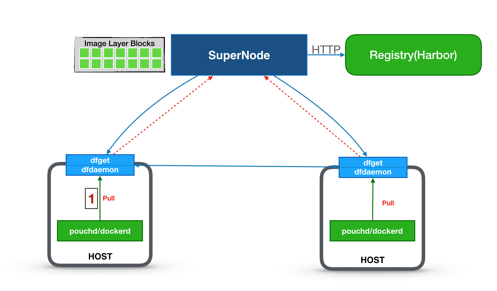

# Dragonfly 多机部署

多机部署文档旨在帮助您在多台机器上充分体验 Dragonfly，如需在生产环境使用 Dragonfly 完成生产级别的镜像与文件分发，请参考 supernode 和 dfget 的详细生产级别配置参数。

## 前提条件

我们假设需要用户准备3台机器，一台扮演 supernode 的角色，另外两台扮演 dfclient 的角色，拓扑结构图如下：



因此，您需要准备以下内容：

1. 准备三台在统一局域网的三台机器，我们假设3台机器IP用以下名字代替：
    * **dfsupernode** 用于部署 Dragonfly 服务端
    * **dfclient0** 用于部署 Dragonfly 客户端
    * **dfclient1** 用于部署 Dragonfly 客户端
2. 以上每台机器上都装有 docker 容器引擎。

## 步骤 1：部署服务端（Supernode） 

在机器 `dfsupernode` 上部署 Dragonfly 服务端（Supernode）：

```bash
docker run -d --name supernode --restart=always -p 8001:8001 -p 8002:8002 \
    dragonflyoss/supernode:0.3.0 -Dsupernode.advertiseIp=dfsupernode
```

> **注意**：`supernode.advertiseIp`必须是客户端能够连通的ip，命令中的`dfsupernode`须以实际的 ip 代替。


## 步骤 2：部署 Dragonfly 客户端

以下操作在客户端机器 `dfclient0`, `dfclient1` 上执行。

**准备配置文件**

Dragonfly 的配置文件默认位于 `/etc/dragonfly` 目录下，使用容器部署客户端时，需要将配置文件挂载到容器内。

为客户端配置 Dragonfly Supernode 地址：

```bash
cat <<EOD > /etc/dragonfly/dfget.yml
nodes:
    - dfsupernode
EOD
```

**启动客户端**

```bash
docker run -d --name dfclient --restart=always -p 65001:65001 \
    -v /etc/dragonfly:/etc/dragonfly \
    dragonflyoss/dfclient:v0.3.0 --registry https://index.docker.io
```

> **提示**：`--registry`参数指定镜像仓库地址，`https://index.docker.io`为官方镜像仓库，您也可以设置为其他仓库地址。

## 步骤 3：修改 Docker Daemon 配置。

我们需要修改 Dragonfly 客户端机器（`dfclient0`, `dfclient1`）上 Docker Daemon 配置，通过 mirror 方式来使用 Dragonfly 进行镜像的拉取。

在配置文件 `/etc/docker/daemon.json` 中添加或更新如下配置项：

```json
{
  "registry-mirrors": ["http://127.0.0.1:65001"]
}
```

重启 Docker Daemon。

```bash
systemctl restart docker
```

> **提示**：如需进一步了解 `/etc/docker/daemon.json`，请参考 [Docker 文档](https://docs.docker.com/registry/recipes/mirror/#configure-the-cache)。

## 步骤 4：拉取镜像

通过以上步骤我们即完成了在多台机器上部署 Dragonfly 的服务端与客户端，并且设置了 Docker Daemon 通过 Dragonfly 来拉取官方镜像。

您可以在 `dfclient0` 和 `dfclient1` 机器上如平时一样来拉取镜像，例如：

```bash
docker pull nginx:latest
```

## 步骤 5：验证镜像P2P分发

在两台机器都成功下载完镜像之后，您可以在 `dfclient0`、`dfclient` 上执行以下命令，检验 nginx 镜像是否通过 Dragonfly 来传输完成。

```bash
docker exec dfclient grep 'downloading piece' /root/.small-dragonfly/logs/dfclient.log
```

如果以上命令有诸如

```
2019-03-29 15:49:53.913 INFO sign:96027-1553845785.119 : downloading piece:{"taskID":"00a0503ea12457638ebbef5d0bfae51f9e8e0a0a349312c211f26f53beb93cdc","superNode":"127.0.0.1","dstCid":"127.0.0.1-95953-1553845720.488","range":"67108864-71303167","result":503,"status":701,"pieceSize":4194304,"pieceNum":16}
```

则说明镜像下载通过Dragonfly来完成了。

如果需要查看镜像是否通过其他 peer 节点来完成传输，可以执行以下命令：

```bash
docker exec dfclient grep 'downloading piece' /root/.small-dragonfly/logs/dfclient.log | grep -v cdnnode
```

如果以上命令没有输出结果，则说明镜像没有通过其他peer节点完成传输，否则说明通过其他peer节点完成传输。

